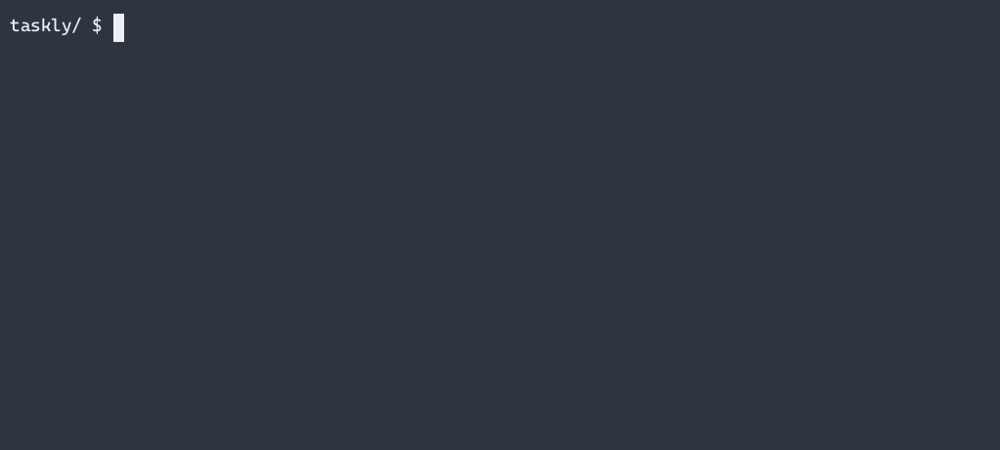

# Taskly: CLI TODO App

<a href="https://roadmap.sh/projects/task-tracker" target="_blank">

</a>

## Description:

Taskly is a command-line interface (CLI) application designed for efficient task management. As the final project for CS50P, this application allows users to add, delete, update, list, and manage tasks through various commands. It provides a straightforward way to interact with a task database using a simple CLI interface, making it an ideal tool for both personal and professional task tracking.

## Features

Taskly offers a range of functionalities that enable users to manage their tasks effectively:

- **Add a Task**: Users can add a new task to their task list by providing a description. Each task is assigned a unique ID and is initially set to the "todo" status.
- **Delete a Task**: Tasks can be removed from the list by specifying their unique ID.
- **Update a Task**: The description of an existing task can be updated. This requires the task's ID and the new description.
- **List Tasks**: Users can list all tasks or filter them by status. The statuses available for filtering are "all", "done", "todo", and "in-progress".
- **Mark Task as In-Progress**: Tasks can be marked as "in-progress" by providing their ID.
- **Mark Task as Done**: Tasks can be marked as "done" by specifying their ID.

## Project Structure

- **taskly.py**: This is the main file containing the implementation of application. It includes:

  - `main()`: The entry point of the application that handles command-line arguments and invokes the appropriate functions.
  - `load_database(path: str)`: Loads the task database from a JSON file.
  - `save_database(database: dict, path: str)`: Saves the task database to a JSON file.
  - `get_supported_queries()`: Returns a dictionary of supported commands and their configurations.
  - `get_querie(supported_queries: dict)`: Parses command-line arguments and returns the corresponding query function and arguments.
  - `add_task(database: dict, description: str)`: Adds a new task to the database.
  - `delete_task(database: dict, id: str)`: Deletes a task from the database.
  - `update_task(database: dict, id: str, description: str)`: Updates the description of a task.
  - `list_task(database: dict, status: str = 'all')`: Lists tasks with optional status filtering.
  - `mark_in_progress_task(database: dict, id: str)`: Marks a task as "in-progress".
  - `mark_done_task(database: dict, id: str)`: Marks a task as "done".

- **test_taskly.py**: Contains tests for the functions defined in `taskly.py`, ensuring that each function performs as expected.

- **requirements.txt**: Lists the dependencies required for the project. Currently, it includes:
  - `tabulate`: A library for creating pretty-print tables.

## Installation and Usage

### **Installation**: can be done via pip

```bash
pip install git+https://github.com/brkahmed/taskly.git
```

### **Usage**: You can now run taskly from command line. Here are some example

- **Add a task**

  ```bash
  $ taskly add "Visit grandma"
  ╭──────┬───────────────┬──────────┬─────────────────────┬─────────────────────╮
  │   Id │ Description   │ Status   │ Created At          │ Updated At          │  ├──────┼───────────────┼──────────┼─────────────────────┼─────────────────────┤
  │    1 │ Visit grandma │ todo     │ 18/08/2024 15:41:07 │ 18/08/2024 15:41:07 │
  ╰──────┴───────────────┴──────────┴─────────────────────┴─────────────────────╯
  $ taskly add "Finish CS50P project"
  ╭──────┬──────────────────────┬──────────┬─────────────────────┬─────────────────────╮
  │   Id │ Description          │ Status   │ Created At          │ Updated At          │
  ├──────┼──────────────────────┼──────────┼─────────────────────┼─────────────────────┤
  │    2 │ Finish CS50P project │ todo     │ 18/08/2024 15:44:56 │ 18/08/2024 15:44:56 │
  ╰──────┴──────────────────────┴──────────┴─────────────────────┴─────────────────────╯
  ```

- **Update a task**

  ```bash
  $ taskly update 2 "Finish CS50P"
  ╭──────┬───────────────┬──────────┬─────────────────────┬─────────────────────╮
  │   Id │ Description   │ Status   │ Created At          │ Updated At          │
  ├──────┼───────────────┼──────────┼─────────────────────┼─────────────────────┤
  │    2 │ Finish CS50P  │ todo     │ 18/08/2024 15:44:56 │ 18/08/2024 15:46:19 │
  ╰──────┴───────────────┴──────────┴─────────────────────┴─────────────────────╯
  ```

- **Mark a task as done**

  ```bash
  $ taskly mark-done 1
  ╭──────┬───────────────┬──────────┬─────────────────────┬─────────────────────╮
  │   Id │ Description   │ Status   │ Created At          │ Updated At          │
  ├──────┼───────────────┼──────────┼─────────────────────┼─────────────────────┤
  │    1 │ Visit grandma │ done     │ 18/08/2024 15:41:07 │ 18/08/2024 15:53:14 │
  ╰──────┴───────────────┴──────────┴─────────────────────┴─────────────────────╯
  ```

- **Mark a task as in-progress**

  ```bash
  $ taskly mark-in-progress 2
  ╭──────┬───────────────┬─────────────┬─────────────────────┬─────────────────────╮
  │   Id │ Description   │ Status      │ Created At          │ Updated At          │
  ├──────┼───────────────┼─────────────┼─────────────────────┼─────────────────────┤
  │    2 │ Finish CS50P  │ in-progress │ 18/08/2024 15:44:56 │ 18/08/2024 15:57:15 │
  ╰──────┴───────────────┴─────────────┴─────────────────────┴─────────────────────╯
  ```

- **List tasks**

  ```bash
  $ taskly list
  ╭──────┬───────────────┬─────────────┬─────────────────────┬─────────────────────╮
  │   Id │ Description   │ Status      │ Created At          │ Updated At          │
  ├──────┼───────────────┼─────────────┼─────────────────────┼─────────────────────┤
  │    1 │ Visit grandma │ done        │ 18/08/2024 15:41:07 │ 18/08/2024 15:53:14 │
  ├──────┼───────────────┼─────────────┼─────────────────────┼─────────────────────┤
  │    2 │ Finish CS50P  │ in-progress │ 18/08/2024 15:44:56 │ 18/08/2024 15:57:15 │
  ╰──────┴───────────────┴─────────────┴─────────────────────┴─────────────────────╯
  $ taskly list --status done
  ╭──────┬───────────────┬──────────┬─────────────────────┬─────────────────────╮
  │   Id │ Description   │ Status   │ Created At          │ Updated At          │
  ├──────┼───────────────┼──────────┼─────────────────────┼─────────────────────┤
  │    1 │ Visit grandma │ done     │ 18/08/2024 15:41:07 │ 18/08/2024 15:53:14 │
  ╰──────┴───────────────┴──────────┴─────────────────────┴─────────────────────╯
  $ taskly list -s todo
  Nothing to display
  ```

- **Delete a task**
  ```bash
  $ taskly delelt 1
  ╭──────┬───────────────┬──────────┬─────────────────────┬─────────────────────╮
  │   Id │ Description   │ Status   │ Created At          │ Updated At          │
  ├──────┼───────────────┼──────────┼─────────────────────┼─────────────────────┤
  │    1 │ Visit grandma │ done     │ 18/08/2024 15:41:07 │ 18/08/2024 15:53:14 │
  ╰──────┴───────────────┴──────────┴─────────────────────┴─────────────────────╯
  $ taskly list
  ╭──────┬───────────────┬─────────────┬─────────────────────┬─────────────────────╮
  │   Id │ Description   │ Status      │ Created At          │ Updated At          │
  ├──────┼───────────────┼─────────────┼─────────────────────┼─────────────────────┤
  │    2 │ Finish CS50P  │ in-progress │ 18/08/2024 15:44:56 │ 18/08/2024 15:57:15 │
  ╰──────┴───────────────┴─────────────┴─────────────────────┴─────────────────────╯
  ```
